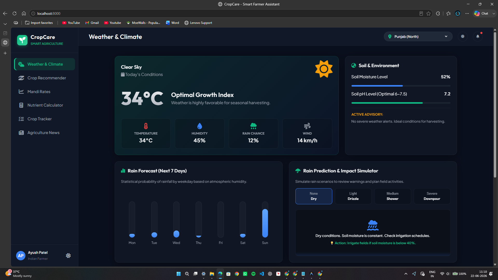
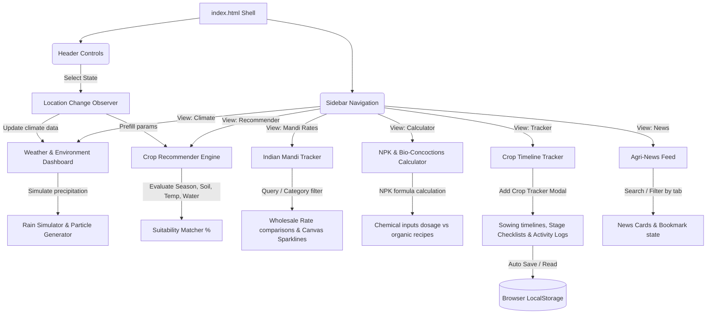

# CropCare - Smart Farmer Assistant

CropCare is an interactive, responsive, and aesthetically premium Single Page Application (SPA) designed to empower Indian farmers with data-driven insights. It aggregates environment details, crop suitability calculations, wholesale mandi rates, organic nutrient recipes, growth timeline tracking, rain forecasting, and agricultural news in a single dark-themed glassmorphic dashboard.



---

## 📋 Table of Contents
1. [Project Details & Overview](#-project-details--overview)
2. [Technology Stack](#-technology-stack)
3. [Workflow Diagram](#-workflow-diagram)
4. [Implementation Plan](#-implementation-plan)
5. [Local Setup & Execution](#-local-setup--execution)

---

## 🌾 Project Details & Overview

Agriculture in India is heavily dependent on weather conditions, seasonal market shifts, and soil health. Farmers often face challenges due to information gaps regarding fluctuating market prices, chemical-to-organic fertilizer conversions, and weather warnings. 

CropCare bridges this gap by offering:
* **Real-Time Climate Diagnostics**: Automated weather, soil pH, and soil moisture calculations customized for six major Indian regions (including Punjab, Maharashtra, Uttar Pradesh, Rajasthan, Kerala, and West Bengal).
* **Crop Recommender**: A scoring algorithm matching current climate data, soil types, and water availability to rank suitable crops (with suitability percentages).
* **Indian Mandi price tracker**: Compares current crop rates (2026) with the previous year's rates (2025) and renders 6-month historical canvas trends.
* **Organic Fertilizer Promoter**: An input calculator that estimates conventional Urea/SSP/MOP dosages alongside organic vermicompost equivalents, and provides step-by-step fermentation recipes for *Jeevamrita*, *Neem Astra*, and *Agnihastra*.
* **Active Crop Tracker**: A checklist-based timeline tracker backed by browser `localStorage` to log crop sowing, weeding, spraying, and harvesting tasks.
* **Agri-News Feed**: Searchable articles covering AgriTech, Government Schemes, and Organic success stories.

---

## 💻 Technology Stack

* **Structure**: Semantic HTML5 (Single Page Application architecture with dynamic section views)
* **Styling**: Vanilla CSS3 (Custom properties, grid & flexbox layouts, CSS backdrop filters for glassmorphism, responsive media queries, keyframe animations)
* **Logic**: JavaScript ES6+ (Native module design pattern, state observers, LocalStorage API, HTML5 Canvas API for dynamic trend-line drawings)
* **Assets**: FontAwesome v6.4 (icons), Google Fonts (Outfit & Plus Jakarta Sans)

---

## 📊 Workflow Diagram



---

## 🛠️ Implementation Plan

### Main Components
* **`index.html`**: Establishes the layout grids, sidebar routing targets, modal form screens, and references all dependencies.
* **`style.css`**: Configures HSL color variables (mint green, deep slate, amber accents), layout boundaries, timeline stepper nodes, and light theme overrides.
* **`app.js`**: Core state orchestrator. Manages initialization states to prevent race conditions, navigation hash routing, theme configuration toggles, and modal states.
* **`js/weather.js`**: Coordinates climate metrics, SVG-based rain charts, and the particle rain simulator.
* **`js/recommender.js`**: Holds the crop parameters database and processes compatibility rankings.
* **`js/rates.js`**: Manages Agmarknet averages and handles HTML5 Canvas path drawings.
* **`js/calculator.js`**: Outputs N-P-K ratios and houses bio-pesticide recipes.
* **`js/tracker.js`**: Powers CRUD timelines, milestone checklists, and logs saving.
* **`js/news.js`**: Controls bookmarks and handles category query filters.

## 🚀 Local Setup & Execution

### 1. Frontend Web Dashboard
1. Open your terminal in the project directory.
2. Launch a local web server to serve the HTML/CSS/JS dashboard on port **8001** (to avoid clashing with the ADK server on port 8000):
   ```bash
   python -m http.server 8001
   ```
3. Open your web browser and load the application:
   **[http://localhost:8001](http://localhost:8001)**

### 2. Backend ADK Agent & MCP Server
1. Ensure you have the `uv` tool installed (standard Python package manager).
2. Install the Python dependencies (including the ADK and MCP SDKs):
   ```bash
   agents-cli install
   ```
3. Configure your Google AI Studio Gemini API Key in the environment file:
   * Open [app/.env](file:///C:/My%20Folder/Capstone%20Project/app/.env)
   * Replace `YOUR_API_KEY` with your actual Gemini API Key.
4. Launch the local ADK server:
   ```bash
   agents-cli playground
   # Or run directly via: uv run adk web .
   ```
   This will start the local agent server on port **8000** and open the ADK developer playground.
5. In your web browser at `http://localhost:8001`, click the **CropCare AI** robot bubble in the bottom right corner to start chatting with the agent! The frontend will communicate directly with the local server to run your agricultural queries and call the MCP server tools under the hood.

